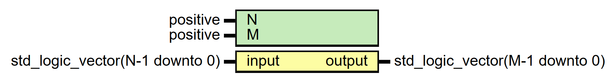

# Entity: Decoder 

- **File**: Decoder.vhd
## Diagram

## Generics

| Generic name | Type     | Value | Description |
| ------------ | -------- | ----- | ----------- |
| N            | positive | 4     |             |
| M            | positive | 16    |             |
## Ports

| Port name | Direction | Type                           | Description |
| --------- | --------- | ------------------------------ | ----------- |
| input     | in        | std_logic_vector(N-1 downto 0) |             |
| output    | out       | std_logic_vector(M-1 downto 0) |             |
## Processes

- unnamed: ( input )
