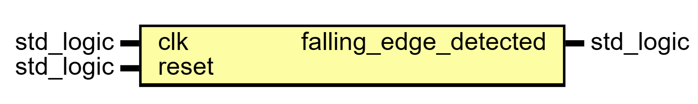

# Entity: Neg_Edge_Detector 

- **File**: Neg_Edge_Detector.vhd
## Diagram

## Ports

| Port name             | Direction | Type      | Description |
| --------------------- | --------- | --------- | ----------- |
| clk                   | in        | std_logic |             |
| reset                 | in        | std_logic |             |
| falling_edge_detected | out       | std_logic |             |
## Signals

| Name     | Type      | Description |
| -------- | --------- | ----------- |
| prev_clk | std_logic |             |
## Processes
- unnamed: ( clk, reset )
