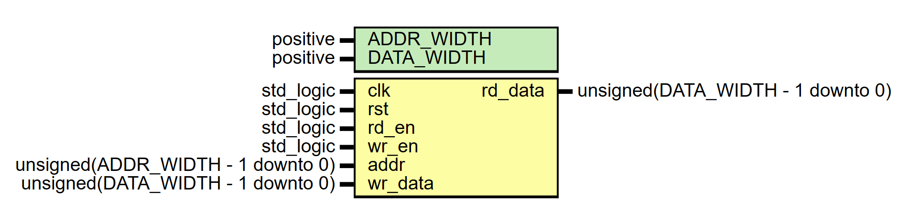

# Entity: RAM 

- **File**: RAM.vhd
## Diagram

## Generics

| Generic name | Type     | Value | Description |
| ------------ | -------- | ----- | ----------- |
| ADDR_WIDTH   | positive | 8     |             |
| DATA_WIDTH   | positive | 8     |             |
## Ports

| Port name | Direction | Type                              | Description |
| --------- | --------- | --------------------------------- | ----------- |
| clk       | in        | std_logic                         |             |
| rst       | in        | std_logic                         |             |
| rd_en     | in        | std_logic                         |             |
| wr_en     | in        | std_logic                         |             |
| addr      | in        | unsigned(ADDR_WIDTH - 1 downto 0) |             |
| wr_data   | in        | unsigned(DATA_WIDTH - 1 downto 0) |             |
| rd_data   | out       | unsigned(DATA_WIDTH - 1 downto 0) |             |
## Signals

| Name   | Type      | Description |
| ------ | --------- | ----------- |
| memory | mem_array |             |
## Types

| Name      | Type | Description |
| --------- | ---- | ----------- |
| mem_array |      |             |
## Processes
- unnamed: ( clk, rst )
