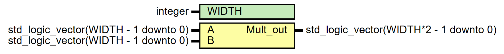

# Entity: Unsigned_Multiplier 

- **File**: Unsigned_Multiplier.vhd
## Diagram

## Generics

| Generic name | Type    | Value | Description |
| ------------ | ------- | ----- | ----------- |
| WIDTH        | integer | 16    |             |
## Ports

| Port name | Direction | Type                                   | Description |
| --------- | --------- | -------------------------------------- | ----------- |
| A         | in        | std_logic_vector(WIDTH - 1 downto 0)   |             |
| B         | in        | std_logic_vector(WIDTH - 1 downto 0)   |             |
| Mult_out  | out       | std_logic_vector(WIDTH*2 - 1 downto 0) |             |
