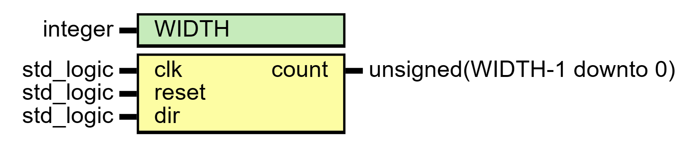

# Entity: Up_Down_Counter 

- **File**: Up_Down_Counter.vhd
## Diagram

## Generics

| Generic name | Type    | Value | Description |
| ------------ | ------- | ----- | ----------- |
| WIDTH        | integer | 8     |             |
## Ports

| Port name | Direction | Type                       | Description |
| --------- | --------- | -------------------------- | ----------- |
| clk       | in        | std_logic                  |             |
| reset     | in        | std_logic                  |             |
| dir       | in        | std_logic                  |             |
| count     | out       | unsigned(WIDTH-1 downto 0) |             |
## Signals

| Name    | Type                       | Description |
| ------- | -------------------------- | ----------- |
| counter | unsigned(WIDTH-1 downto 0) |             |
## Processes
- Up_Down_Counter_Process: ( clk, reset )
